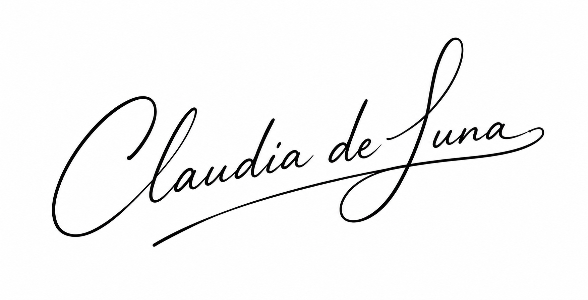
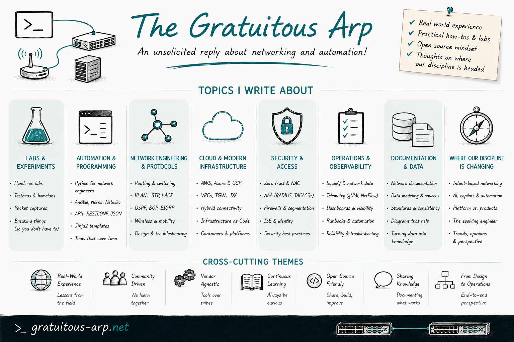

# Claudia de Luna

NAF Advisory Board Submission

## Submission Essay

Over the last decade+, my work and writing have focused on helping network engineers move from artisanal CLI work to disciplined, testable automation built on shared data models, version-controlled state, and observable pipelines. Today, we are at the next inflection point: AI is being layered on top of that automation, often faster than our operating models and governance can keep up. I heard a Stanford professor describe today’s workforce as “classical, pre-GenAI educated,” and that resonated deeply with me. I am committed to helping those engineers, including myself, figure out how we work, grow, and lead in a post-GenAI environment. My primary motivation for wanting to continue on the NAF Advisory Board is to help shape how our community navigates that shift through conferences, education, by any means necessary really, preserving the human craft and operational rigor of networking while embracing AI as a force multiplier rather than a shortcut.

Through hands-on work with open-source, MCP-based assistants, testing topologies, and automation frameworks, I work where network data, automation platforms, and LLMs intersect. On *The Gratuitous Arp*, I write about the move from ad-hoc spreadsheets to schema-driven sources of truth, the evolving meaning of network automation, and the use of AI to make networks more explainable and operationally safe. I want to continue to bring that practitioner perspective, grounded in lab work, production experience, and community storytelling, to support NAF’s mission of making automation and AI accessible, repeatable, and vendor-agnostic.

My employer actively supports my involvement with NAF and gives me wide latitude for community-facing projects. I can commit consistent time over the next two years for reviewing submissions, contributing to program design, and responding quickly to requests. I have no conflicts that would limit my participation, and I am comfortable evaluating technologies, methodologies, and vendors on their merits without bias.

Thank you for your consideration,

Respectfully submitted,

## Personal links

- Blog: [gratuitous-arp.net](https://gratuitous-arp.net/)
- LinkedIn: [linkedin.com/in/claudiadeluna](https://www.linkedin.com/in/claudiadeluna/)
- BlueSky: [@delunac.bsky.social](https://bsky.app/profile/delunac.bsky.social)

## The Gratuitous Arp

